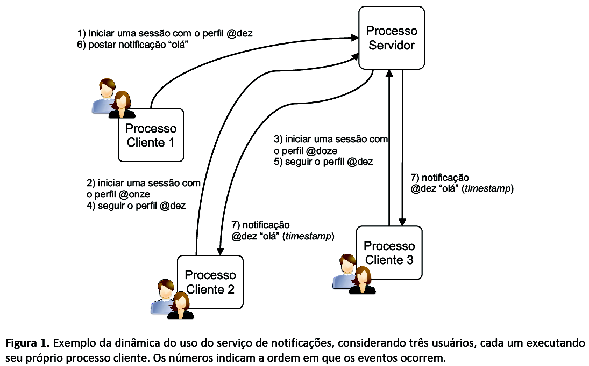
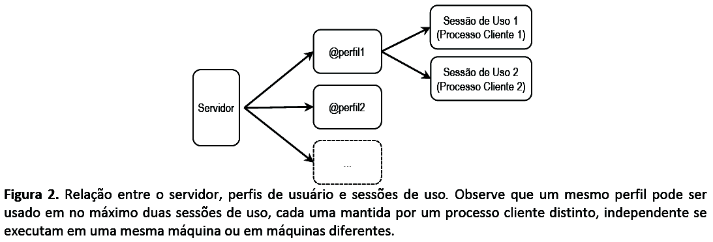
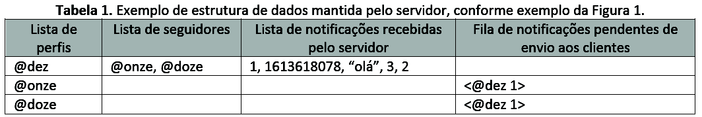
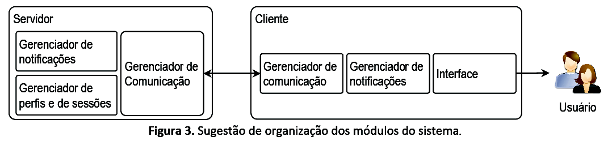

# Trabalho prático da cadeira de SISOPII

## Especificação

A proposta de trabalho prático é implementar um serviço de envio de notificações estilo “feed de notícias”, muito
similar ao Twitter. Os usuários farão uso do serviço por meio de perfis, postando notificações em nome de um
determinado perfil, e que serão recebidas por todos os seguidores desse perfil. Observe que a ideia de perfis, no
contexto desta proposta de trabalho prático, é similar aos perfis em redes sociais como o Twitter (por ex., @ufrgs).

A proposta deverá ser desenvolvida em duas etapas. A primeira etapa compreenderá funcionalidades que
dependerão de tópicos como threads, processos, comunicação e sincronização para serem implementadas. A
aplicação deverá executar em ambientes Unix (Linux), mesmo que tenha sido desenvolvida em outras plataformas.
O projeto deverá ser implementado em C/C++, usando a API Transmission Control Protocol (TCP) sockets do Unix.

## Descrição do serviço e funcionalidade básicas

O projeto compreenderá um app para usuários (cliente) e um servidor. O cliente permitirá ao usuário fazer uso do
serviço de notificações. Quando o usuário iniciar um processo cliente, o cliente estabelecerá uma conexão com o
servidor e iniciará uma “sessão de uso” atrelada ao “perfil” do usuário. Um perfil é uma cadeia de 4 a 20 caracteres
que permite identificar um usuário no serviço (por exemplo, @estudante). O nome de perfil deverá ser informado
pelo usuário, via linha de comando, ao iniciar o cliente. A comunicação entre o cliente e servidor (e,
consequentemente, a sessão) deverá ser mantida estabelecida para o usuário fazer uso do serviço, conforme
descrito a seguir.

Durante uma sessão de uso o usuário poderá, a qualquer momento, 1) registrar-se para receber notificações de
outro perfil (isto é, “seguir” um perfil) e 2) enviar notificações (em outras palavras, postar um “tweet”). As
notificações são mensagens de texto curtas. Cada notificação enviada estará atrelada ao perfil usado na sessão, ou
seja, será de autoria do perfil passado como parâmetro ao processo cliente. As notificações deverão ser enviadas a
todos os seguidores daquele perfil. O usuário receberá apenas aquelas notificações enviadas por um determinado
perfil a partir do instante que passar a segui-lo. O servidor não deverá enviar a um cliente as notificações postadas
antes de passar a seguir o referido perfil. A Figura 1 ilustra um exemplo da dinâmica do funcionamento do serviço.

Um usuário poderá usar o mesmo nome de perfil em, no máximo, duas sessões de uso (logo, em dois processos
cliente distintos) simultaneamente, conforme exemplificado na Figura 2. O servidor deverá recusar novas tentativas
de iniciar uma sessão com um mesmo perfil quando houver duas sessões ativas para esse mesmo perfil. O usuário
poderá encerrar a qualquer momento um processo cliente e, portanto, a sessão mantida pelo processo. O
encerramento do processo não deverá afetar a outra sessão de uso do mesmo perfil, caso existente. Ao iniciar
novamente o app cliente informando um perfil existente, o servidor deverá enviar ao usuário todas as notificações
enviadas, pelos perfis que este usuário segue, no período em que esteve offline. No entanto, caso esse perfil tenha
outra sessão de uso que permaneceu ativa, ao se iniciar o novo processo, as notificações enviadas no período e 
recebidas pela sessão de uso ativa não deverão ser reenviadas ao novo processo (Isso é, ao iniciar um novo processo cliente usando um mesmo perfil, o mesmo conjunto de notificações enviados pelos 
perfis que este cliente segue deverá ser exibido em ambos os clientes, na mesma ordem. No entanto, as notificações que foram enviadas ao
processo em execução, antes da inicialização do novo processo cliente, não deverão ser reenviadas ao novo processo cliente.).





O serviço deve fornecer suporte às seguintes funcionalidades básicas:

- **Múltiplas sessões de uso**: O servidor deve lidar com vários acessos simultâneos ao serviço, ou seja, deve
atender a várias sessões de diversos usuários ao mesmo tempo;

- **Múltiplas sessões de uso de um mesmo perfil**: Um perfil pode ser utilizado em no máximo duas sessões
de uso. Caso um usuário tentar iniciar uma terceira sessão com um mesmo perfil, o servidor deverá
recusar essa nova sessão;

- **Consistência nas estruturas de armazenamento e troca de mensagens**: As estruturas de armazenamento
de dados no servidor devem ser mantidas em um estado consistente. As notificações enviadas por um
perfil devem ser distribuídas a todos os seguidores. O servidor deverá enviar aos processos cliente dos
respectivos seguidores as mensagens na mesma ordem que forem recebidas pelo servidor;

- **Persistência de dados no servidor**: Os perfis dos usuários e a relação de seguidores de cada perfil devem
ser restabelecidos caso o servidor seja reinicializado. No entanto, as mensagens pendentes de envio não
devem ser reestabelecidas no caso de falha no servidor (isso será abordado na segunda parte do trabalho).

## Implementação do sistema

A proposta de trabalho prático está dividida em duas etapas, sendo que a segunda etapa irá contemplar
funcionalidades adicionais. Portanto, considere uma implementação modular e com possibilidade de extensão, e o
encapsulamento das funções de comunicação do cliente e do servidor em módulos isolados.

Para o funcionamento do serviço, o servidor deverá manter em uma estrutura de dados a lista de perfis existentes,
incluindo os respectivos seguidores do perfil, a lista de notificações enviadas em nome daquele perfil, e a fila de
notificações pendentes de entrega por perfil. Ao receber uma nova conexão de um cliente, caso o perfil informado
pelo cliente ainda não tenha sido usado (e, portanto, não conste na relação de perfis), o servidor deverá criar o
perfil e incluir na lista. A Tabela 1 ilustra as informações mantidas nessa estrutura para o exemplo da Figura 1.



Cada notificação terá um conjunto de metadados: o identificador da notificação, o perfil autor da notificação, o
instante (timestamp) em que a notificação foi recebida pelo servidor, a quantidade de caracteres da notificação e o
número de seguidores que ainda não receberam a mensagem. No exemplo acima, esses valores são,
respectivamente, 1, @dez, 1613618078, 3 e 2. O sistema poderá manter outros metadados para cada notificação, a
critério da equipe. Como sugestão, o identificador de notificação pode ser um número inteiro único global, para
facilitar o controle de envio de notificações aos seguidores. Em relação à fila de notificações pendentes, ela indicará
quais notificações o(s) processo(s) cliente de um determinado perfil ainda precisa(m) receber.

A Figura 3 apresenta uma sugestão de como a equipe pode organizar as funcionalidades do sistema em módulos e
implementá-las. Os módulos de comunicação são responsáveis por operações de troca de dados entre o processo
servidor e os processos cliente. Os módulos de gerenciamento de notificações são responsáveis por gerenciar o
envio das notificações para destinatários, incluindo os metadados de cada notificação. Por fim, o módulo de
gerência de perfis e de sessões é responsável pela manutenção dos perfis existentes e seus respectivos seguidores.



O processo servidor deverá implementar um esquema baseado no modelo produtor/consumidor para gerenciar o
recebimento e entrega de mensagens de e para clientes. Em particular, o servidor manterá múltiplas instâncias de
produtores/consumidores entre cada perfil e seus seguidores. Quando o servidor receber uma notificação enviada
por um perfil, essa notificação funcionará como uma “produção”. Considerando o exemplo da Tabela 1, a
“produção” de uma notificação envolverá (1) receber a notificação do processo cliente, (2) escrever a notificação
na lista de notificações pendentes de envio e (3) para cada seguidor, atualizar a fila de notificações pendentes de
recebimento. De forma análoga, o “consumo” de uma notificação envolverá (1) recuperar (e remover) um
identificador de notificação da fila de pendentes, (2) enviar a respectiva notificação ao processo cliente e (3)
decrementar o valor de envios pendentes no metadado da notificação. Esses passos deverão ser implementados no
servidor e repetidos enquanto houver notificações na fila.

Observe que a escrita de notificações será uma operação não bloqueante, enquanto a leitura de notificações será
uma operação bloqueante. A thread do servidor que “consome” notificações, enviando-as para o cliente de um
perfil, ficará bloqueada enquanto não houver novas notificações. Observe ainda que uma notificação será removida
da lista de notificações somente após todos os seguidores que devem recebê-la consumirem a mesma. Ao alcançar
o valor 0 (zero), a notificação deverá ser excluída da estrutura de dados mantida pelo servidor.

## Interface do usuário

Um cliente deve poder estabelecer uma sessão de uso com o servidor via linha de comando utilizando:
```
./app_cliente <perfil> <endereço do servidor> <porta>
```
onde *perfil* representa o identificador do perfil, *endereço do servidor* e *porta* representam o endereço IP do
servidor e a porta, respectivamente.

Após iniciar uma sessão, o usuário poderá indicar quais perfis ele deseja seguir e receber notificações. Para tal, o
usuário deverá emitir o seguinte comando para receber todas as notificações enviadas por @username:
```
FOLLOW @username
```
Apenas as notificações enviadas pelo perfil após o comando *FOLLOW* deverão ser recebidas pelo novo seguidor.
Um perfil não poderá executar o comando *FOLLOW* para seguir a si mesmo.

O app poderá enviar notificações, através do comando:
```
SEND <message to send>
```
Onde **message to send** é uma notificação de até 128 caracteres (similar a um tweet) que deverá ser enviado para o
servidor, e por sua vez repassado a todos os seguidores.

A interface do cliente deve ter uma thread para escrever as mensagens na tela, e outra thread para ler as
notificações e comandos digitados pelo usuário. Ao apertar CTRL+C (interrupção) ou CTRL+D (fim de arquivo), o
processo cliente deverá encerrar, sinalizando ao servidor que o usuário está desconectando do serviço.

## Formato de estruturas

A equipe tem liberdade para definir o tamanho e formato das mensagens que serão usadas para troca de dados
entre o app do cliente e o servidor. Sugere-se a especificação de uma estrutura para definir as mensagens trocadas
entre cliente/servidor. Abaixo é apresentada uma sugestão de como implementar a estrutura para a troca de
comandos e mensagens entre os processos cliente e servidor.

```c
typedef struct __packet {
    uint16_t type; //Tipo do pacote (p.ex. DATA | CMD)
    uint16_t seqn; //Número de sequência
    uint16_t length; //Comprimento do payload
    uint16_t timestamp; // Timestamp do dado
    const char* _payload; //Dados da mensagem
} packet;
```

Abaixo segue uma sugestão para implementar os metadados de uma notificação. Observe que cada perfil terá sua
própria lista de notificações criadas, portanto o nome do perfil não necessariamente precisa fazer parte da
estrutura abaixo.

```c
typedef struct __notification{
    uint32_t id; //Identificador da notificação (sugere-se um identificador único)
    uint32_t timestamp; //Timestamp da notificação
    const char* _string; //Mensagem
    uint16_t length; //Tamanho da mensagem
    uint16_t pending; //Quantidade de leitores pendentes
} notification;
```

## Descrição do relatório
A equipe deverá produzir um relatório fornecendo os seguintes dados:

- Descrição do ambiente de testes: versão do sistema operacional e distribuição, configuração da máquina
(processador(es) e memória) e compiladores utilizados (versões);
- Explicação e respectivas justificativas a respeito de:
    - Como foi implementada a concorrência no servidor para atender múltiplos clientes;
    - Em quais áreas do código foi necessário garantir sincronização no acesso a dados;
    - Descrição das principais estruturas e funções que a equipe implementou;
    - Explicar o uso das diferentes primitivas de comunicação;
- Descrição dos problemas que a equipe encontrou durante a implementação e como estes foram
resolvidos (ou não).

A nota será atribuída baseando-se nos seguintes critérios: (1) qualidade do relatório produzido conforme os itens
acima, (2) correta implementação das funcionalidades requisitadas e (3) qualidade do programa em si (incluindo
uma interface limpa e amigável, documentação do código, funcionalidades adicionais implementadas, etc).

## Data e métodos de avaliação

O trabalho deve ser feito em grupos de 3 OU 4 INTEGRANTES. Não esquecer de identificar claramente os
componentes do grupo no relatório.

Faz parte do pacote de entrega os arquivos fonte e o relatório em um arquivo ZIP. O trabalho deverá ser entregue
até às 08:30 do dia 29 de setembro. A entrega deverá ser via moodle (link para submissão no Tópico 08). As
demonstrações ocorrerão no mesmo dia, no horário da aula.

Após a data de entrega, o trabalho deverá ser entregue via e-mail para alberto@inf.ufrgs.br (subject do e-mail deve
ser “INF01151: Trabalho Parte 1”). Neste caso, será descontado 02 (dois) pontos por semana de atraso. O atraso
máximo permitido é de duas semanas após a data prevista para entrega. Isto é, nenhum trabalho será aceito após
o dia 13 de outubro.