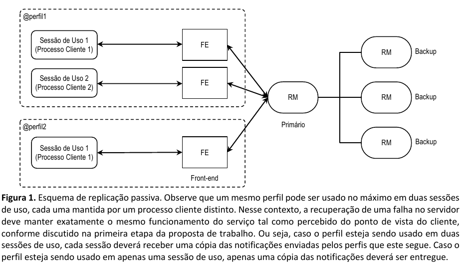

# Trabalho prático - parte2 da cadeira de SISOPII

## Especificação do trabalho

A proposta de trabalho prático é implementar um serviço de envio de notificações estilo “feed de notícias”, muito similar ao Twitter. Os usuários farão uso do serviço por meio de perfis, postando notificações em nome de um determinado perfil, e que serão recebidas por todos os seguidores desse perfil. Observe que a ideia de perfis, no contexto desta proposta de trabalho prático, é similar aos perfis em redes sociais como o Twitter (por ex., @ufrgs). 

A proposta deverá ser desenvolvida em duas etapas. A primeira etapa compreendeu funcionalidades implementadas usando conceitos como threads, processos, comunicação e sincronização. Na segunda etapa, a equipe deverá estender o serviço com algumas funcionalidades avançadas, onde destaca-se: esquema de replicação com eleição de líder. A aplicação deverá executar em ambientes Unix (Linux), mesmo que tenha sido desenvolvida em outras plataformas. O projeto deverá ser implementado em C/C++, usando a API Transmission Control Protocol (TCP) sockets do Unix.

## Funcionalidade Avançadas

Na segunda parte deste projeto, a aplicação deverá ser estendida para atender os conceitos estudados na segunda metade da disciplina: replicação e eleição de líder.

1. **Replicação passiva**

O servidor implementado, caso venha a falhar, levará à indisponibilidade do serviço de envio de notificações. Este é um estado que não é desejável no serviço. Para aumentar a disponibilidade do serviço na ocorrência de falhas do servidor principal, um novo servidor deverá assumir o seu papel e manter o serviço de envio de notificações funcionando. Note que essa mudança deve ser transparente para os usuários, e suas notificações devem ser enviadas aos respectivos seguidores mesmo após a falha. Além disso, as notificações já entregues não devem ser reenviadas após a recuperação da falha. Para garantir que os perfis, os seguidores de cada perfil, e o conjunto de notificações ainda não entregues estarão disponíveis no novo servidor, você deverá utilizar um esquema de replicação, informando todas as modificações realizadas aos servidores secundários.

Mais especificamente, você deverá implementar um esquema de Replicação Passiva, onde o servidor é representado por uma instância primária de replica manager (RM), e uma ou mais instâncias de RM secundárias (ou backup). Podemos entender este modelo adicionando um front-end (FE) entre a comunicação do cliente (C) e o conjunto de RMs. O front-end é responsável por realizar a comunicação entre os clientes e o serviço de replicação, tornando transparente para o cliente qual é a cópia primária do servidor (Figura 1).

Seu esquema precisará garantir que:

**(1)** todos os clientes sempre utilizarão a mesma cópia primária (RM primário);

**(2)** após cada operação, o RM primário irá propagar o estado aos RMS de backup;

**(3)** somente após os backups serem atualizados o RM primário confirmará a operação ao cliente.

2. **Eleição de líder**

Algoritmos de eleição de líder permitem escolher, dentro de um conjunto de processos distribuídos, qual processo deve desempenhar um papel particular (e.g., coordenador, alocador de recursos, verificador, etc.). Algoritmos de eleição de líder são muito usados como parte de outros algoritmos distribuídos, que exigem a escolha de um processo para desempenhar um papel especifico. Na primeira parte do trabalho, assumiu-se a existência de um único servidor. Agora, no entanto, como diferentes processos potencialmente poderão assumir o papel de servidor primário, o processo escolhido em questão deverá ser selecionado através de um dos algoritmos de eleição de líder vistos em aula: algoritmo do anel ou algoritmo do valentão. Quando o servidor principal falhar, o algoritmo de eleição de líder deverá ser utilizado para determinar o próximo servidor primário. Nesse caso, um dos servidores backup deverá assumir essa função, mantendo um estado consistente do sistema. Para isso, implemente um dos algoritmos vistos em aula para eleger um novo RM primário após uma falha. Lembre-se de garantir que seu mecanismo atualize as informações sobre o novo líder nos FE dos clientes.

## Descrição do relatório

A equipe deverá produzir um relatório fornecendo os seguintes dados:

- Descrição do ambiente de testes: versão do sistema operacional e distribuição, configuração da máquina
(processador(es) e memória) e compiladores utilizados (versões);
- Explicação e respectivas justificativas a respeito de:
    - funcionamento do algoritmo de eleição líder implementado, justificando a escolha;
    - implementação da replicação passiva na aplicação, incluindo os desafios encontrados.
- Também inclua no relatório uma descrição dos problemas que a equipe encontrou durante a implementação e como estes foram resolvidos (ou não).

A nota será atribuída baseando-se nos seguintes critérios: (1) qualidade do relatório produzido conforme os itens
acima, (2) correta implementação das funcionalidades requisitadas e (3) qualidade do programa em si (incluindo
uma interface limpa e amigável, documentação do código, funcionalidades adicionais implementadas, etc).

## Data e métodos de avaliação

O trabalho deve ser feito em grupos de 3 OU 4 INTEGRANTES. Não esquecer de identificar claramente os
componentes do grupo no relatório.

Faz parte do pacote de entrega os arquivos fonte e o relatório em um arquivo ZIP. O trabalho deverá ser entregue
até às 08:30 do dia **10 de novembro**. A entrega deverá ser via moodle (link para submissão no Tópico 19). As
demonstrações ocorrerão no mesmo dia, no horário da aula.

Após a data de entrega, o trabalho deverá ser entregue via e-mail para alberto@inf.ufrgs.br (subject do e-mail deve
ser “INF01151: Trabalho Parte 2”). Neste caso, será descontado 02 (dois) pontos por semana de atraso. O atraso
máximo permitido é de duas semanas após a data prevista para entrega. Isto é, nenhum trabalho será aceito após
o dia 17 de novembro.